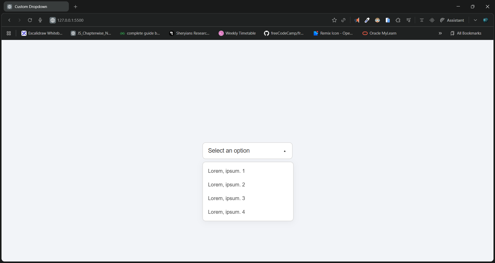

# 🎯 Custom Animated Dropdown Menu

A clean, modern, and fully interactive **custom dropdown component** built with **HTML, CSS, and JavaScript**.
Smooth animations, overlay click-close, and a minimal UI make this ideal for forms, settings panels, and reusable UI kits.

---

## 🚀 Live Demo

🔗 **Live Link:** []()

---

## 🌄 Preview



---

## 🎥 Demo Video


▶️ **Video Demo:** [click to watch](./demo.mp4)

---

## 📂 Project Structure

```
📁 Custom-Dropdown/
│── index.html        # Main HTML structure
│── style.css         # UI styling & animations
│── script.js         # Dropdown logic & interaction
```

---

## ✨ Features

* ✔️ Smooth open/close animation
* ✔️ Click-outside to close (overlay layer)
* ✔️ Accessible, simple HTML structure
* ✔️ Pure vanilla JS — no dependencies
* ✔️ Clean UI with hover effects
* ✔️ Easily customizable

---

## 🧠 How It Works

### **HTML Structure**

Your dropdown uses a clean wrapper containing:

* A selected value area
* A dropdown menu list
* A transparent overlay for click-outside detection


### **JavaScript Logic**

* Toggles `.open` class on click
* Updates selected text
* Closes dropdown when user clicks outside


### **CSS Styling**

* Handles fade-in animation
* Menu positioning
* Hover & click interactions
* Dropdown rotation icon


---

## 🛠️ Installation & Usage

Clone the project:

```bash
git clone 
```

Open the project:

```bash
cd custom-dropdown
```

Run locally (just open in browser):

```
index.html
```

---

## 🎨 Customization

You can easily modify:

* Colors
* Border styles
* Font sizes
* Animation speed
* Dropdown item labels

All from `style.css` and `index.html`.

---

## 📜 License

This project is **free to use** — modify or integrate into your own projects.

---

## 🧑‍💻 Author

👤 **Dileep kumawat**
- 📧 [dileepkumawat525@gmail.com](mailto:dileepkumawat525@gmail.com)
- 🔗 [LinkedIn](https://www.linkedin.com/in/dileep-kumawat/)

---